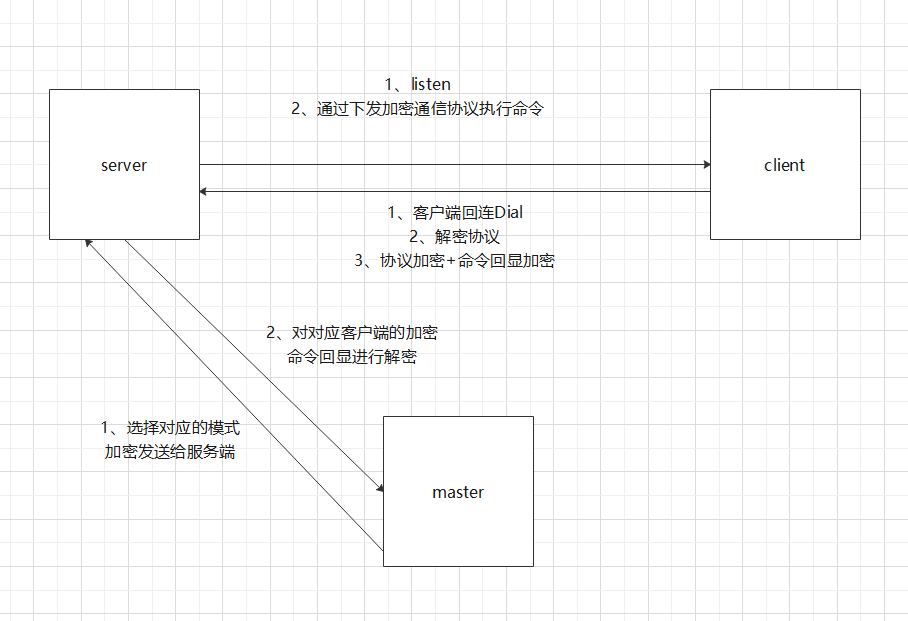

- ### 自研的linux c2
1、传输加解密√  
2、参数化入参x 
3、数据库接入存储 记录c2上线的日志、主机信息等等√ 
4、log日志x

----------------

- ### c2研发脑图

---------------------------------------

- bug修复日志

23年/5月/20日 client-c2端，存在逻辑bug问题
client端需要进行逻辑判断，然后再给服务端发送对应的协议。。服务端的协议对不上，就有bug了
socket/client-modity/client-c2.go

23年/5月/21日 client-c2端，解决逻辑bug问题 新增检查存活探测

23年5月23日  ps、netstat等无法获取全部内容消息

23年5月28日 解决23日的bug
能完全显示ps和netstat等长命令回显

23年5月31日 接入sqlite3存储c2上线日志
主机名、上线时间、连接的ip
